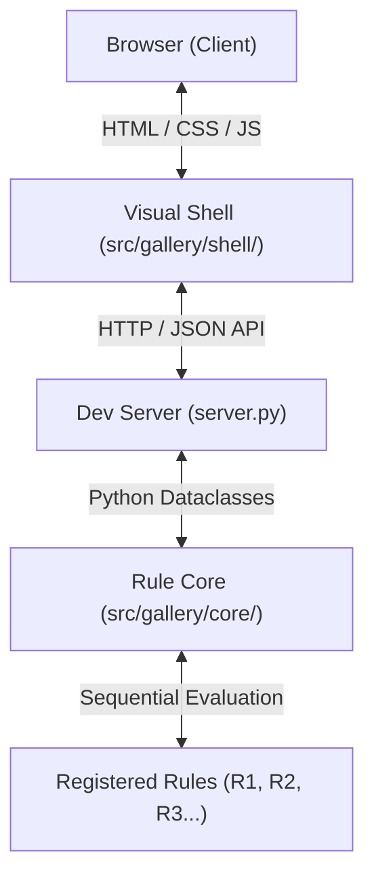

# AGENTS.md — Savant Gallery Workspace Router & Protocol

Welcome, Agent. This is the canonical developer router and source of truth for the Savant Photo Gallery project. Read and execute on these guidelines flawlessly.

---

## 1. Core Architecture: Pure Core + Visual Shell

The application is structured as a robust, decoupled system combining a pure Python decision engine with a premium presentation layer:

* **The Rule Core (`src/gallery/core/`):** Pure, deterministic Python logic. Contains frozen dataclasses (`Request`, `Decision`), base rule classes, and sequential rules. Must maintain **100% test coverage** and **10.00/10 pylint score**.
* **The Visual Shell (`src/gallery/shell/`):** Interactive frontend (`index.html`, `style.css`, `app.js`) and a lightweight Python development server (`server.py`) serving files and exposing `/api/evaluate`.
* **Design Aesthetic:** High-end dark mode, glassmorphism (`backdrop-filter`), vibrant glow gradients, smooth micro-animations, and responsive layout scaling.

---

## 2. Speed-Oriented High-Velocity Workflow

We do **not** split user stories into core and shell sub-issues. Every user story is implemented, verified, and shipped **fully integrated (Core + UI) as a single cohesive unit.**

### The Pipeline Steps:
1. **`/specify #<n>` (The Specification Step):**
   * Read the GitHub issue.
   * Write/update `SPEC.md` covering **both the Python rule models and the visual interface/transition requirements**.
   * Create the branch `issue/<n>-<short-kebab-title>`.
   * **Stop for quick approval.**

2. **`/implement` (The Unified Execution Step):**
   * Write the core rule subclassing `Rule` in `src/gallery/core/rules/`.
   * Register it in `src/gallery/core/engine.py` in precedence order.
   * Create core unit tests and engine integration tests (TDD).
   * Update the Visual Shell (`index.html`, `style.css`, `app.js`, `server.py`) to fully deliver the corresponding visual card elements, interactions, animations, and backend mapping.
   * Verify **pytest coverage is 100%** and **pylint is 10.00/10**.
   * **Stop for approval** (unless the user requested an *all-at-once* turn).

3. **`/commit` (The Traceability Step):**
   * Create a conventional commit: `type(scope): summary (#n)`.

4. **`/ship` (The Merge Step):**
   * Push branch, open Pull Request with `Closes #n`, wait for CI checks, squash-merge, delete branch, and pull up-to-date `main`.

> [!TIP]
> **Fast-Track Delivery:**
> If the user commands an all-at-once instruction (e.g., *"Implement US3 completely, commit, and ship in one turn"*), the agent is **fully authorized to bypass step-by-step pauses** and execute the `/implement`, `/commit`, and `/ship` steps sequentially in a single turn to maximize developer velocity.

---

## 3. General Conventions & Guardrails

* **Zero Placeholder Policy:** Never write placeholder code or empty components. Implement beautiful, working production elements. Use curated Unsplash images for media.
* **Pure Core Functions:** The core engine must have zero I/O, no network calls, and be completely deterministic.
* **No Inline Disables:** Never add `# pylint: disable=too-few-public-methods` or similar comments to files. Manage all overrides centrally in `pyproject.toml`.
* **Main Branch Protection:** Never attempt to commit directly to `main`. Commits must land on issue branches.

---

## 4. Current Repository Status & Next Steps

* **Current Issue:** None (Backlog clean, `main` branch synced).
* **Next Available Feature:** **[US3] Dynamic Category Filters** (`#7`) or **[US2] Interactive Lightbox View** (`#6`).
* **Dev Server Command:** `.venv/bin/python src/gallery/shell/server.py` (Runs on port `8080`).